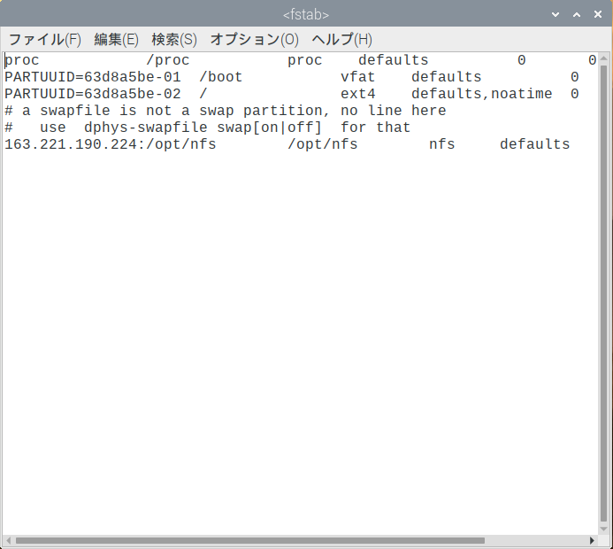

# Raspberry Piの操作

本セミナーで用いるRaspberry Piには，LinuxというOperating System (OS) をインストールして使用します
(正確には，LinuxをベースにしたRaspbianというOS)．
Linuxは，みなさんが普段使っているWindowsやmacOSなどのOSとは異なりますが，
ほとんどのスーパコンピュータにおいて採用されています．
また，ウェブサービスの多くもLinuxの上で動いています．

本章では，Raspbianの操作について簡単に説明します．


## ファイルマネージャ

Raspberry Pi上のファイルを操作するためには，ファイルマネージャを使用します．
ファイルマネージャは，デスクトップ左上のフォルダのアイコンをクリックすると起動します．


Windowsのエクスプローラに対応します．


## ターミナル

Linuxでは，基本的な操作はGraphical User Interface (GUI) でできますが，
より高度・複雑な操作を行う際にはCharacter User Interface (CUI) を用います．
CUIによる操作を行うためには，**ターミナル**というソフトウェアを使用します．

ターミナルを起動するには，デスクトップ左上の黒いウィンドウをクリックします．


するとターミナルが開きます．ここにコマンドという文字列を入力することでRaspberry Piを操作します．


以下に本セミナーで用いるコマンドを列挙しておきます．
各コマンドの詳細な使用法については，`man <コマンド名>`や`<コマンド名> --help`
を参照してください．インターネット上にも多数の解説が存在します．

- ファイル操作
    - `ls`: ディレクトリ内のファイルとディレクトリを一覧表示
    - `cd`: カレントディレクトリを移動
    - `pwd`: カレントディレクトリを表示
    - `mkdir`: ディレクトリを作成
    - `chmod`: ファイル/ディレクトリのアクセス権限を変更
    - `cat`: ファイルの中身を表示
    - `rm`: ファイル/ディレクトリを削除
    - `cp`: ファイル/ディレクトリをコピー
- システム管理
    - `sudo`: 後に続くコマンドを管理者権限で実行
    - `apt`: システムにインストールされているソフトウェアを追加・削除
    - `systemctl`: システム
    - `mount`: 外部のファイルシステムをマウントする
- プログラム開発
    - `gcc`: コンパイラ (C言語のソースコードを実行可能ファイルに翻訳)
    - `mpicc`: MPIプログラム用コンパイラ
    - `mpirun`: MPIプログラム用ランチャ
    - `time`: 後に続くコマンドの実行時間を表示

## テキストエディタ

設定ファイルなどのテキストファイルを編集するためには，テキストエディタを使用します．
Raspberry PiにはMousepadというエディタがインストールされています．
Windowsのメモ帳に対応します．



Mousepadでファイルを編集するには，ターミナル上で下記のコマンドを実行します．

```text
$ mousepad ファイル名
```

また，編集に管理者権限が必要なファイルを編集するには，`sudo`と組み合わせます．

```text
$ sudo mousepad ファイル名
```
