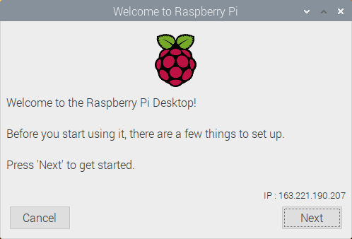
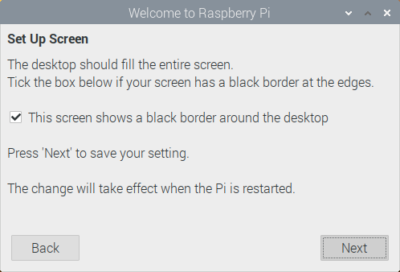
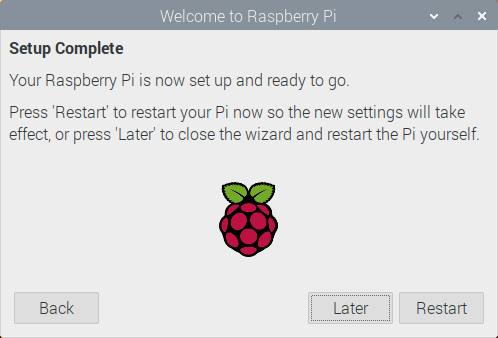

## OSのインストール

Raspberry Pi向けに最適化された，RaspbianというOSをSDカードに書き込ます．

### SDカードの準備

1. Raspberry Piの[公式サイト](https://www.raspberrypi.org/downloads/raspbian/)
からRaspbian Buster with desktop (Image with desktop based on Debian Buster)
をダウンロードします．ダウンロードしたzipファイルを展開しておきます．

2. OSをSDカードに書き込むためのソフトウェアEtcherをインストールします．
Etcherの[公式サイト](https://www.balena.io/etcher/)からインストーラ
をダウンロードし，インストールしてください．

3. SDカードをPCに接続し，Etcherを起動してください．
    "Select image"でRaspbianのディスクイメージを選択し，
    "Select target"でSDカードを選択し，"Flash!"を押して書き込みを実行します．


### Raspbianのインストール

Raspberry PiにSDカードを挿入し，ディスプレイ・キーボード・マウスを接続したら，
電源を接続してください．Raspberry Piの起動画面が表示された後，Raspbianの
インストーラが表示されます．

1. 初期画面: Nextを押します．

    

1. **Set Country**: Countryから"Japan"を選択し，Nextを押します．

    

2. **Change Password**: テキストボックスは空のまま，Nextを押します．
    (本来はパスワードを変更すべきですが，今回のクラスタは学内からしかアクセス
    できないので省きます)

    

3. **Set Up Screen**: "This screen shows a black border around the desktop"に
    チェックを入れ，Nextを押します．

    

4. **Select Wifi Network**: Skipを押します． (有線で接続します)

    

5. **Update Software**: Skipを押します．

    

6. **Setup Complete**: Laterを押します．

    

### ネットワークの設定

自動的にNAISTのネットワークに接続されていますが，自動的に割り当てられた
アドレスを使用しているため，アドレスが変わってしまう問題があります．

`/etc/dhcpcd.conf`を編集し，下記の行を追加します．

```text
interface eth0
static ip_address=XXX.XXX.XXX.XXX/XX
static routers=163.221.190.1
static domain_name_servers=163.221.8.11 163.221.8.12
```

`XXX.XXX.XXX.XXX/XX`の部分はRasPiごとに下記のように変えてください．

- `163.221.190.121/24`
- `163.221.190.121/24`
- `163.221.190.121/24`
- `163.221.190.121/24`

ホスト名を設定します．`XXX`の部分はRasPiごとに下記のように変えてください．

```
$ sudo hostnamectl set-hostname XXX
```

- `sd-niku01.naist.jp`
- `sd-niku02.naist.jp`
- `sd-niku03.naist.jp`
- `sd-niku04.naist.jp`

以上でOSのインストール作業は完了です．一度Raspberry Piを再起動してください．
