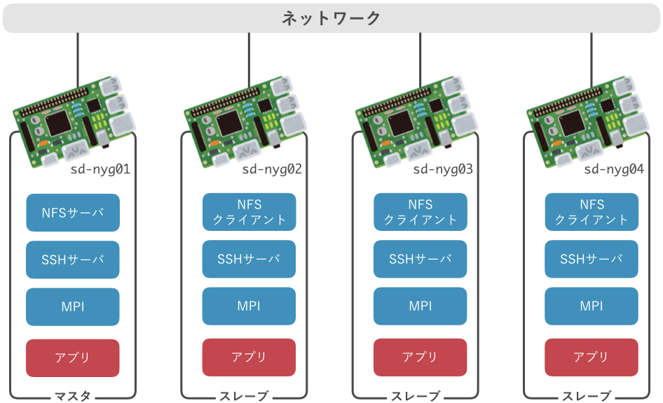

# クラスタの構築

本セミナーでは，複数台のRaspberry Piを相互接続し，小規模な**クラスタ**を構築します．
構築するクラスタの概要を下図に示します．

クラスタを構成するコンピュータのことを**ノード**と呼びます．
本クラスタは，1台の**マスタ・ノード**と3台の**スレーブ・ノード**，計4台のノードから構成します．
マスタは各スレーブを管理し，スレーブはマスタから指示を受けて計算を実行します．

各ノードには，NFS，SSH，MPIの3つのソフトウェアをインストール・設定します．
それぞれのソフトウェアの役割は次の通りです．

1. マスタからスレーブを操作するための **Secure SHell (SSH)**
2. マスタとスレーブの間でファイルを共有するための **Network File System (NFS)**
3. 全ノードで協調動作し，並列計算を実現するための **Message Passing Interface (MPI)**

以降の節では，まずRaspberry Pi用のOSであるRaspbianをインストールした後，
各ソフトウェアを順にインストール・設定します．

> 実際のスパコンでは，今回のクラスタで用いるソフトウェアのほか，
>
> - 計算資源の管理・割当を行うための**ジョブスケジューラ**
> - ノードの状態や障害を監視するための**監視・ログ収集基盤**
> - ノード間で時刻を正確に同期するための**時刻同期システム**
> - ノードのセットアップを自動化する**構成管理システム**
>
> などのシステムソフトウェアに加え，
> 多数の科学技術計算用アプリケーションやライブラリがインストールされています．
