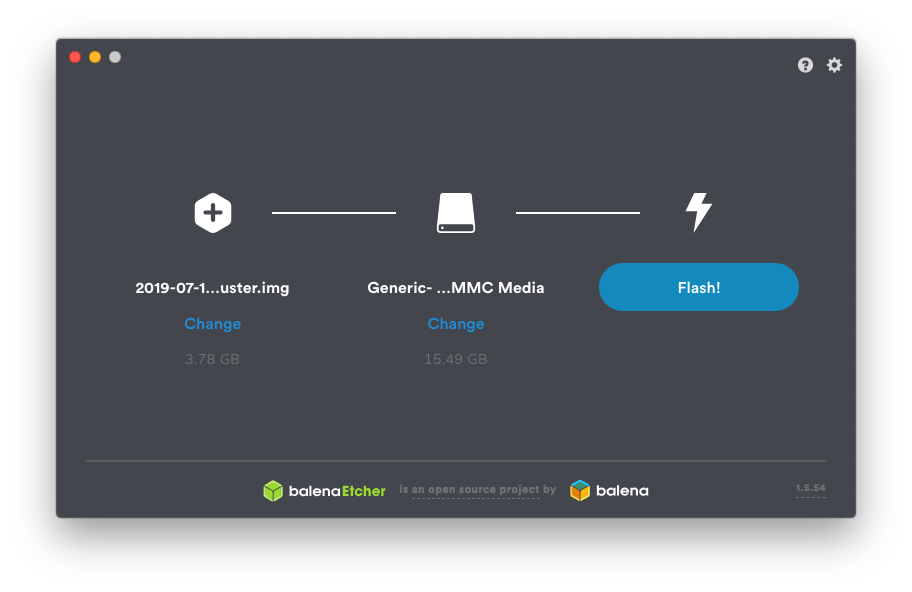
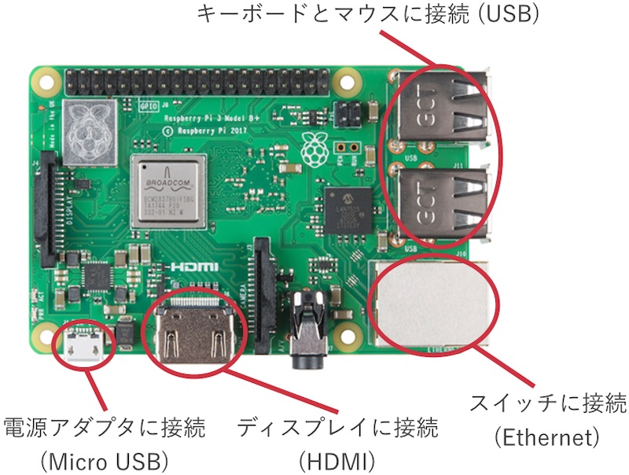
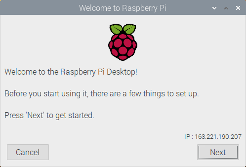
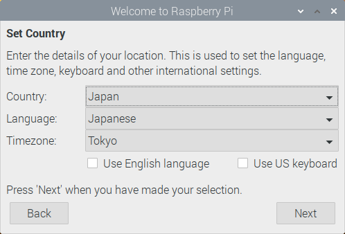
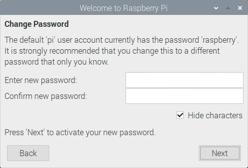
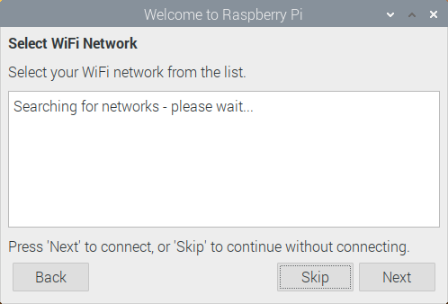
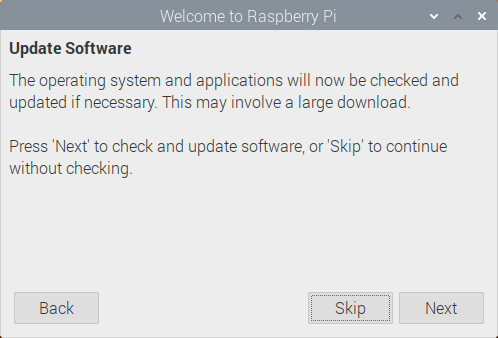
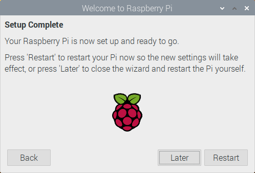

# OSのインストール

この節では，Raspberry Pi向けに最適化された，Raspberry Pi OSというOSをインストールします．

## SDカードの準備

1. **ディスクイメージの準備**:
Raspberry Piの[公式サイト](https://www.raspberrypi.org/downloads/raspberry-pi-os/)
からRaspberry Pi OS (32-bit) with desktop
をダウンロードします．ダウンロードしたzipファイルを展開し，
SDカードに書き込むためのディスクイメージ(.imgファイル)を取り出しておきます．

2. **ライティングソフトの準備**:
OSをSDカードに書き込むためのソフトウェアEtcherをインストールします．
Etcherの[公式サイト](https://www.balena.io/etcher/)からインストーラ
をダウンロードし，インストールしてください．

3. **ディスクイメージの書き込み**:
SDカードをPCに接続し，Etcherを起動してください．
    "Select image"でRaspberry Pi OSのディスクイメージを選択し，
    "Select target"でSDカードを選択し，"Flash!"を押して書き込みを実行します．



## ハードウェアの準備

Raspberry Piの裏面のスロットにディスクイメージを書き込んだSDカードを挿入してください．
ディスプレイ，キーボード，マウス，ネットワークケーブルを接続した後，電源を接続してください．
電源のコネクタは汎用のMicro USBですが，消費電流が大きいため，必ず専用のアダプタを使用してください．
Raspberry Piには電源ボタンが存在せず，電源を接続すると即座に起動が始まります．



### Raspberry Pi OSのインストール

電源を投入すると，Raspberry Piの起動画面が表示された後，Raspberry Pi OSのインストーラが表示されます．

1. **初期画面**: Nextを押します．

    

1. **Set Country**: Countryから"Japan"を選択します．使用しているキーボードがUSレイアウトの場合は，Use US keyboardにチェックを付け，Nextを押します．

    

2. **Change Password**: テキストボックスは空のまま，Nextを押します．
    (本来はパスワードを変更すべきですが，今回のクラスタは学内からしかアクセス
    できないので省きます)

    

3. **Set Up Screen**: "This screen shows a black border around the desktop"に
    チェックを入れ，Nextを押します．

    

4. **Select Wifi Network**: Skipを押します． (有線で接続します)

    

5. **Update Software**: Skipを押します．

    

6. **Setup Complete**: Laterを押します．

    

## ネットワークの設定

ここまでの作業でRaspberry Piは自動的にNAISTのネットワークに接続されています．
しかし，NAISTのネットワークから自動的に割り当てられたIPアドレスを使用しているため，
再起動時にIPアドレスが変わる可能性があります．これは後々の設定に不都合なため，
各ノードのIPアドレスを固定します．

まず，IPアドレスを自動設定をするプログラム (dhcpcd) を停止します．

```
sudo systemctl stop dhcpcd
sudo systemctl disable dhcpcd
```

次に，`/etc/network/interfaces.d/eth0`に下記の内容のファイルを新規作成します．

```text
auto eth0
iface eth0 inet static
	address XXX.XXX.XXX.XXX
	netmask 255.255.255.0
	gateway 163.221.190.1
```

`XXX.XXX.XXX.XXX`の部分はRaspberry Piごとに下記のように変えてください．

- 1台目: `163.221.190.131`
- 2台目: `163.221.190.132`
- 3台目: `163.221.190.133`
- 4台目: `163.221.190.134`

ホスト名を設定します．`XXX`の部分はRaspberry Piごとに下記のように変えてください．

```
$ sudo hostnamectl set-hostname XXX
```

- 1台目: `sd-narakita01.naist.jp`
- 2台目: `sd-narakita02.naist.jp`
- 3台目: `sd-narakita03.naist.jp`
- 4台目: `sd-narakita04.naist.jp`

以上でOSのインストール作業は完了です．一度Raspberry Piを再起動してください．

```
$ sudo reboot
```

最後に，IPアドレスとホスト名を正しく設定できていことを確認しましょう．

IPアドレスの確認には，`ip`コマンドを使用します．`inet`の横に表示されている値が
IPアドレスです．

```
$ ip address show eth0
2: eth0: <BROADCAST,MULTICAST,UP,LOWER_UP> mtu 1500 qdisc pfifo_fast state UP group default qlen 1000
    link/ether b8:27:eb:ab:5b:6f brd ff:ff:ff:ff:ff:ff
    inet 163.221.190.131/24 brd 163.221.190.255 scope global noprefixroute eth0
       valid_lft forever preferred_lft forever
    inet6 fe80::91a8:486b:2b7a:4ff8/64 scope link
       valid_lft forever preferred_lft forever
```

ホスト名の確認には，`hostname`コマンドを使用します．

```
$ hostname
sd-narakita01.naist.jp
```

### CPU周波数の設定

最後に，RasPiの性能を最大限引き出すために，CPUの周波数を最大値で固定しましょう．

```
$ sudo apt install linux-cpupower
$ sudo cpupower frequency-set -g performance
```
