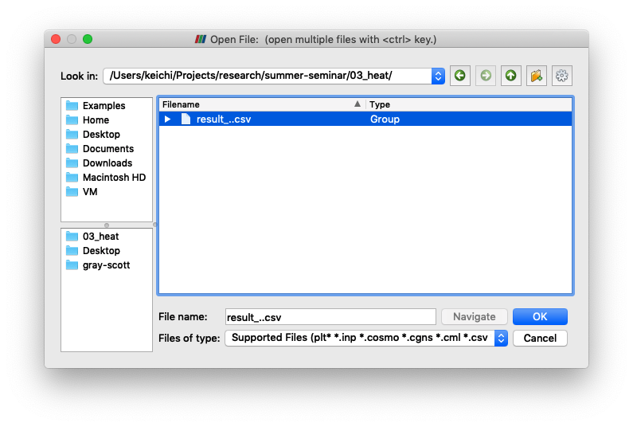

# ParaViewの使い方

ParaViewを[公式サイト](https://www.paraview.org/download/)からダウンロードし，インストールします．
ParaViewを起動すると，次のような画面が表示されます．

画面左上の "Open" ボタンをクリックし，シミュレータが出力したCSVファイルを選択しましょう．

ウィンドウ左下の "Properties" タブにある "Apply" ボタンを押してください．

画面右側に，CSVファイルの中身が表示されます．
また，画面左上の "Pipeline Browser" に，"result_*" というアイコンが追加されます． (名前は読み込んだCSVファイル名によって変わります)

新しいビューを開くため，"Layout #1" の横にある， "+" ボタンをクリックしてください．

"Render View" ボタンをクリックしましょう．

空のビューが開きます．画面左上の "Pipeline Browser" にある，"result_*" という
アイコンを右クリックし，"Add Filter" -> "Alphabetical" -> "Table To Points" を選んでください．

"Pipeline Browser" に，"TableToPints1" というアイコンが追加されます．

ウィンドウ左下の "Properties" タブで下記の設定を行ってください．

- "Properties" セクション
    - "X Column": "T" を "x" に変更
    - "Y Column": "T" を "y" に変更
    - "Z Column": "T" を "x" に変更
    - "2D Points" をチェック
- "Coloring" セクション
    - "Solid Color" を "T" に変更
    - "Use Separate Color Map" をクリック
- "Styling" セクション
    - "Point Size" を3に変更

"Apply" ボタンを押してください．
また，"Pipeline Browser" の "TableToPints1" の横の目のアイコンをクリックし，目が開いた状態にしてください．

シミュレーション結果が可視化されます．画面上の再生ボタンを押すと，時間経過とともに熱が伝導していく様子がアニメーション表示されます．
