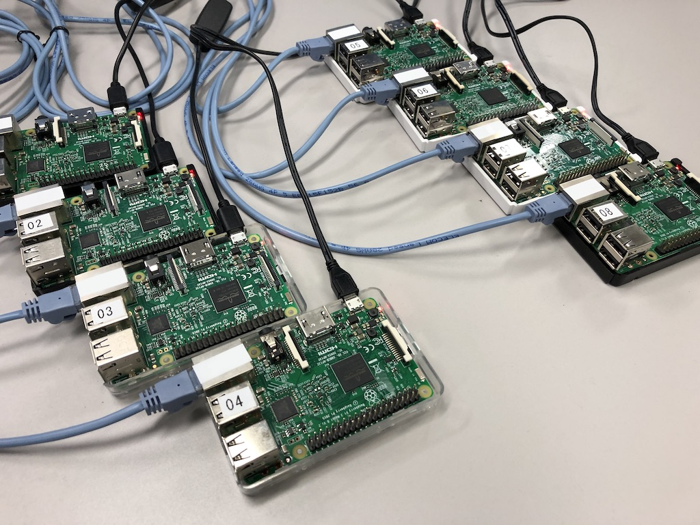

# ミニ・スーパコンピュータを自作しよう！

本セミナーでは，実際の大規模なスーパコンピュータが採用しているソフトウェア群を用い，
複数台の小型PC (Raspberry Pi) を相互接続した小規模な計算クラスタを構築します．
構築したクラスタ上で並列分散計算を行うアプリケーションを実行し，
スーパコンピュータの仕組みを理解します．

説明に用いたスライドは [こちら](img/ssh-labstay.pdf)

奈良先端科学技術大学院大学 [ソフトウェア設計学研究室](https://sdlab.naist.jp/)
